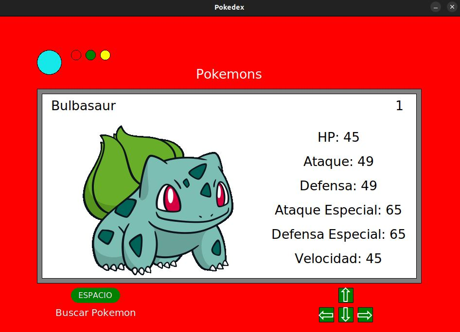
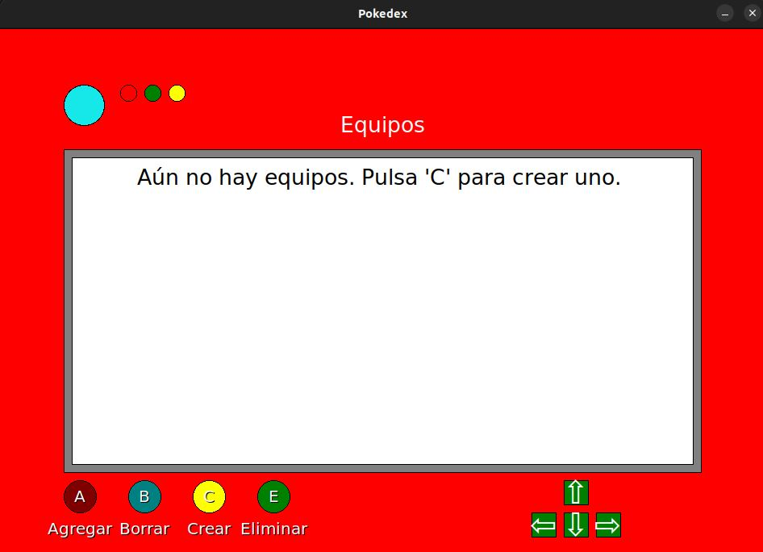
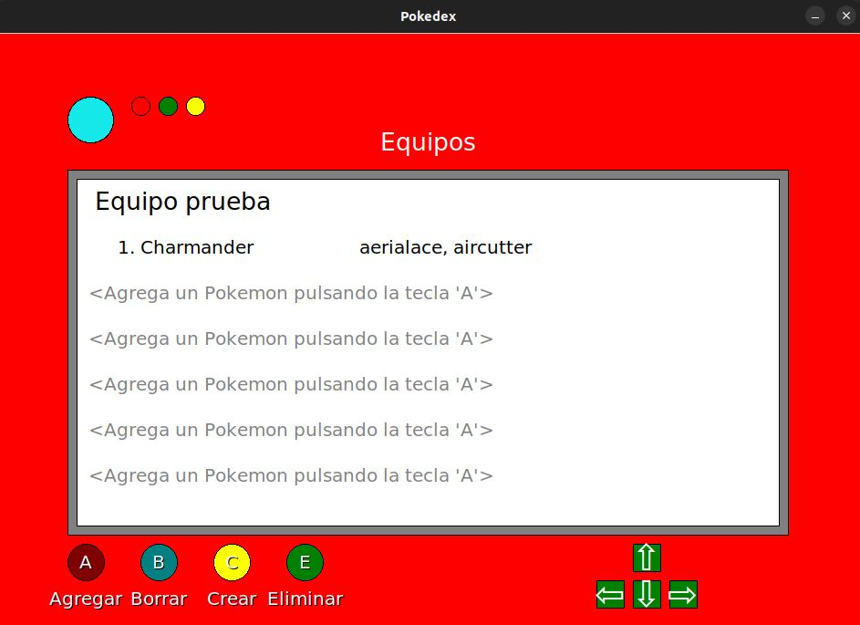

# Pokedex

Algoritmos y Programación I - [1C 2021]

Trabajo que consiste en una Pokedex

## Grupo

* **Integrante 1** - [Alan Valdevenito](https://github.com/AlanValdevenito)
* **Integrante 2** - [Mateo Julián Rico](https://github.com/ricomateo)

## Ejecucion

Ejecutar en una terminal:

```
$ python3 main.py
```

Se abrira la siguiente ventana donde podremos ver los Pokemon disponbiles:



Presionando la tecla FLECHA HACIA ARRIBA podremos ir a la ventana de equipos:



Presionando la tecla C podremos crear un equipo eligiendo un nombre para el mismo y luego agregar los pokemon que esten disponbiles:


